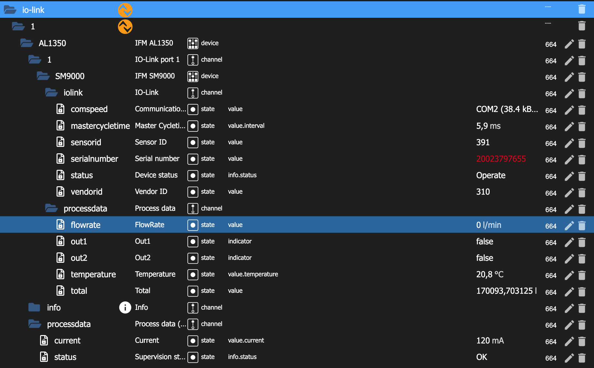

# ioBroker.io-link

### 0.1.1
Rename adapter and generalize function for different IO-Link sensors

### Description
This adapter enables the integration of IO-Link sensors.

### Supported sensors

* [Magnetic-inductive volumetric flow meters from the manufacturer IFM](devices/IfmFlowSensor)
* Pressure sensors from the manufacturer WIKA
* Pressure sensors (also for manometric level measurement) from the manufacturer IFM

### Usage
* Install this adapter to ioBroker (Expert mode -> install from url)
* Create an instance of this adapter
* Enter your AL1350/AL1352 IP address

## Changelog
* 0.1.1 Rename adapter and generalize function for different IO-Link sensors
* 0.0.1 Inital release

## Credits
This app is made possible by contributions from:
* [Elias Rümmler](http://www.100prznt.de) ([@100prznt](https://github.com/100prznt))

## License
The ioBroker.io-link Adapter is licensed under [MIT](http://www.opensource.org/licenses/mit-license.php "Read more about the MIT license form"). Refer to [LICENSE](https://github.com/100prznt/ioBroker.io-link/blob/master/LICENSE) for more information.

## Contributions
Contributions are welcome. Fork this repository and send a pull request if you have something useful to add.

-----------

Copyright &copy; 2022 Elias Ruemmler <pool@100prznt.de>
